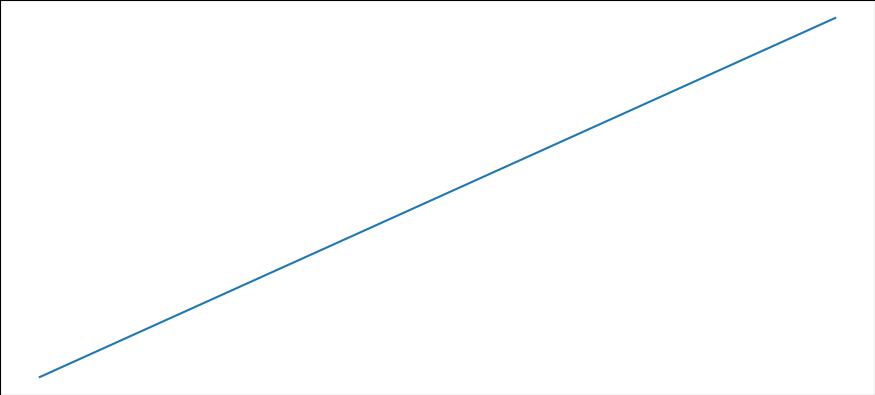
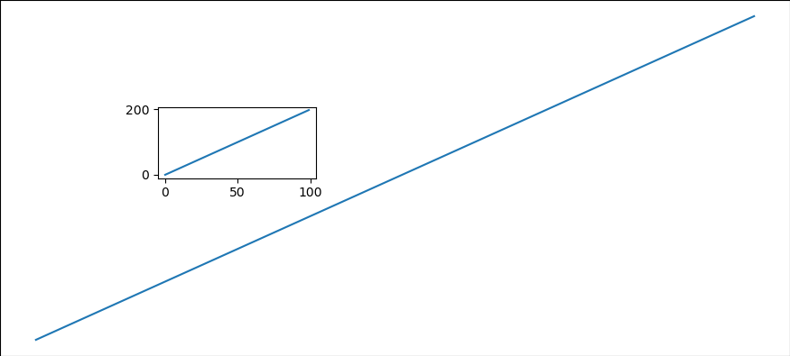
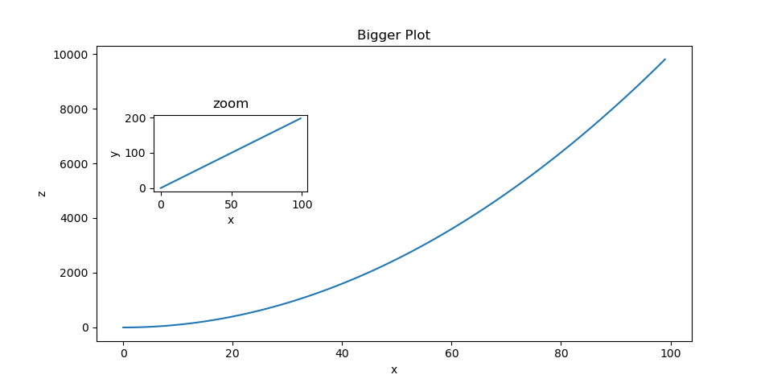
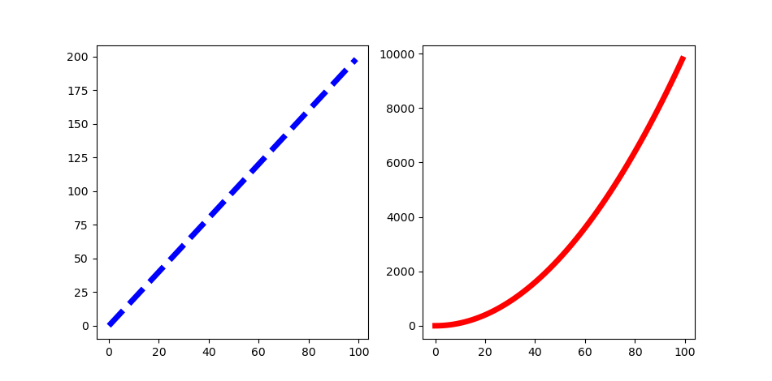

# Matplotlib Exercises

## Exercise 1

Follow along with these steps: 
- Create a figure object called fig using plt.figure() **
-  Use add_axes to add an axis to the figure canvas at [0,0,1,1]. Call this new axis ax. 
-  Plot (x,y) on that axes and set the labels and titles to match the plot below:


````python
fig = plt.figure()
ax = fig.add_axes([0,0,1,1])

ax.plot(x,y)

plt.show()
````

This code returns the following graph 



## Exercise 2

Create a figure object and put two axes on it, ax1 and ax2. Located at [0,0,1,1] and [0.2,0.5,.2,.2] respectively.

````python
fig = plt.figure()

ax1 = fig.add_axes([0,0,1,1]) 
ax2 = fig.add_axes([0.2, 0.5, 0.2, 0.2 ])

ax1.plot(x,y)
ax2.plot(x,y)
ax2.set_xlabel('x')
ax2.set_ylabel('y')
plt.show()
````



If the code above is ran on a .py file, then the output won't show the axes for the large plot.


## Exercise 3


````python
fig = plt.figure()

axes1 = fig.add_axes([0, 0, 1, 1])

axes1.plot(x,z) # larger plot
axes1.set_xlabel("x")
axes1.set_ylabel("z")
axes1.set_xlim([0,100])
axes1.set_ylim([2000,10000])


axes2 = fig.add_axes([0.2, 0.5, 0.4, 0.4])

axes2.plot(x,y) # smaller plot
axes2.set_xlabel("x")
axes2.set_ylabel("y")
axes2.set_title("zoom")
axes2.set_ylim([30, 50])
axes2.set_xlim([20,22])

````

Same problem as last time; the `add_axes` method does not show the axes for the larger plot.
````python
fig, ax1 = plt.subplots()

ax2 = fig.add_axes([0.2, 0.5, 0.2, 0.2 ])


# Larger Plot
x = np.linspace(0,5, 11)
y = x ** 2
# z = x ** 2

fig  = plt.figure()

ax1 = fig.add_subplot(1,1,1)
ax1.plot(x,y)
ax1.set_xlabel('x')
ax1.set_ylabel('y')
ax1.set_title('Bigger Plot')


ax2 = fig.add_axes([0.2, 0.5, 0.2, 0.2 ])

ax2.plot(x,y)
ax2.set_xlabel('x')
ax2.set_ylabel('y')
ax2.set_title('zoom')

fig.savefig("exer3.png")
````
which returns the following plot



## Exercise 4

````python
fig, axes = plt.subplots(1,2, figsize = (12,2)) # nrows = 1, ncols = 2
axes[0].plot(x,y, color = "blue",linestyle = "--", linewidth = 2.00)
axes[1].plot(x,z, color = "red", linewidth = 4.00)
````


which returns the following plot:

