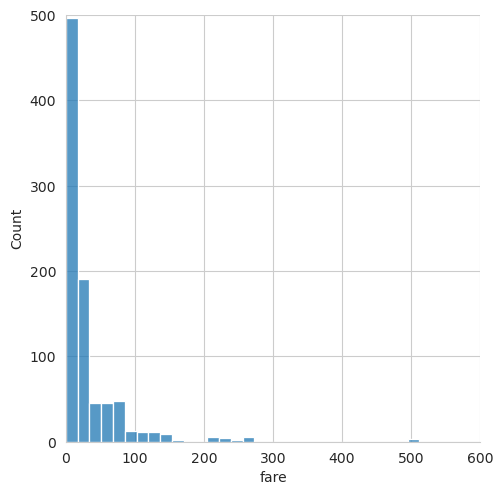

# Seaborn exercises

## Preparation


We'll get some intro things out of the way:
````python
import seaborn as sns
import matplotlib.pyplot as plt
sns.set_style('whitegrid')
titanic = sns.load_dataset('titanic')
titanc.head()
## insert code here
plt.show() # don't forget to include this
````


## Exercise 1 (Jointplots)

````python

sns.jointplot(x='fare',y='age',data = titanic, kind = 'scatter')
plt.show()
````
which returns the following plot:


## Exercise 2 (distplot)
Working with `displot()`.
````python

fig = sns.displot(titanic['fare'], kde = False, color = 'red', bins = 30)
# the color does not matter 
plt.xlim([0,600])
plt.ylim([0,500])

plt.show()
````

which returns the following plot:



## Exercise 3

````python
fig = sns.boxplot(x = 'class' , y = 'age', data = titanic, palette = 'rainbow' )
# pallette part does not matter
plt.show()

````
which returns the following box plot:


## Exercise 4 

````python
fig = sns.swarmplot(x = "class", y = "age", data = titanic)
````

which returns the following plot:


## Exercise 5

````python
sns.countplot(x = 'sex', data = titanic)
plt.show()
````
which returns the following graph:


## Exercise 6 (Working with Heatmaps)


````python
sns.heatmap(titanic.corr())

````
which outputs the following heatmap:


## Exercise 7 (FacetGrids)

````python
fig = sns.FacetGrid(titanic, col = "sex") # Creates a two column grid based on the sex column of the titanic data set
fig = fig.map(plt.hist, "age") # maps the grid onto a histogram plot using "age" as the data set for analysis
plt.show() # shows the plot
````

