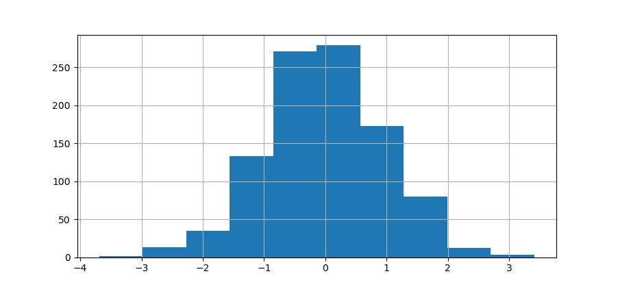
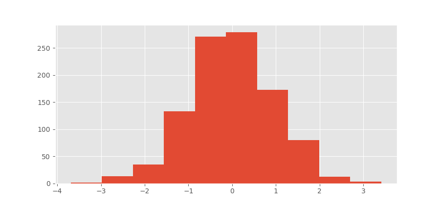
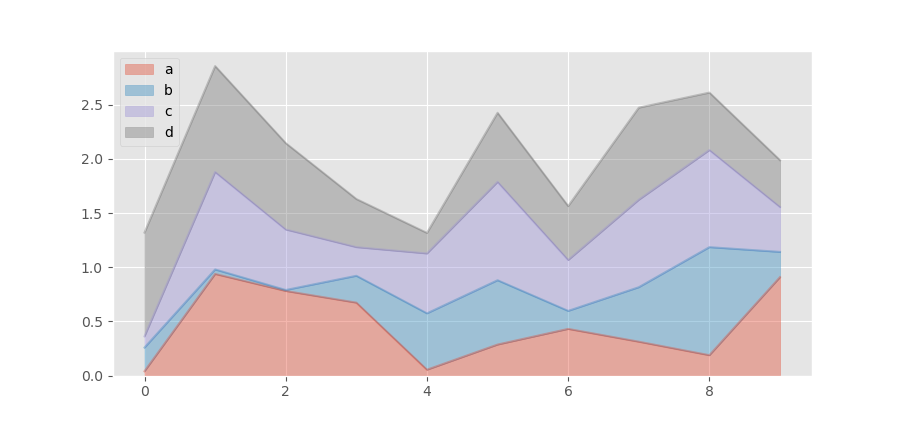
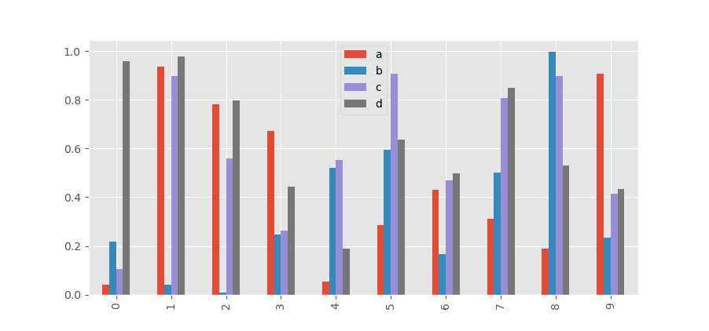

# Pandas Data Visualizations

Mostly used for quick analysis of data.  

Before we start, we will do our usual importing of modules we need and reading in csv files.

````python
import numpy as np
import pandas as pd
import seaborn as sns
import matplotlib.pyplot as plt

df1 = pd.read_csv('df1', index_col = 0) # first data frame
df2 = pd.read_csv('df2') # second data frame
````

## Style Sheets

We can use the pandas visualization library to take any column from a data frame and visulize the data in terms of a histogram; that is, we can type 
````python
df1['A'].hist()
````
which will return the following histogram plot:



If we type in 
````python
plt.style.use('ggplot')
````
at the very top of our python file then the histogram plot we generated earlier will look a little nicer; that is, we have 



## Plot Types

Some plot types we will use that is buil in to the pandas library are the following 

* df.plot.area     
* df.plot.barh     
* df.plot.density  
* df.plot.hist     
* df.plot.line     
* df.plot.scatter
* df.plot.bar      
* df.plot.box      
* df.plot.hexbin   
* df.plot.kde      
* df.plot.pie

Another way we call these different types of plots is to use the following syntax:

````python
df.plot(kind = 'some_plot')
````
where `some_plot` is any plot from the list of plots above.


### Area

The following produces an area graph with each curve representing the area of the data accumulated in each column of the second data frame `df1`:
````python
df2.plot.area(alpha = 0.4)
````


### Barplots

Let us first check out the head of the second data frame `df2`.
````python
df2.head()

````
which returns the following:
````
          a         b         c         d
0  0.039762  0.218517  0.103423  0.957904
1  0.937288  0.041567  0.899125  0.977680
2  0.780504  0.008948  0.557808  0.797510
3  0.672717  0.247870  0.264071  0.444358
4  0.053829  0.520124  0.552264  0.190008
````

If we want to visualize this data in a barplot, we simply type the following:
````python
df2.plot.bar()
# or 
df2.plot(kind = 'bar')
````
which returns the following plot:

If we wanted to stack the the bars for each row it represents in the data frame `df2, then all we need to do is type in 
````python
df2.plot.bar(stacked = True)
````
which we return the following plot:
