# 911 Calls Capstone Project

For this capstone project we will be analyzing some 911 call data from Kaggle. The data contains the following fields:


  -  lat : String variable, Latitude
  -  lng: String variable, Longitude
  -  desc: String variable, Description of the Emergency Call
  -  zip: String variable, Zipcode
  -  title: String variable, Title
  -  timeStamp: String variable, YYYY-MM-DD HH:MM:SS
  -  twp: String variable, Township
  -  addr: String variable, Address
  -  e: String variable, Dummy variable (always 1)

We will start by importing the necessary modules: 

````python
import numpy as np
import pandas as pd
import matplotlin.pyplot as plt
import seaborn as sns
````

Let's start by reading in the csv file and assign it to the variable `df` where:
````python
df = pd.read_csv('911.csv')
````

We can check the info of this dataframe by typing the following code:

````python
df.info()
````
which should return the following information about our data:

````
 #   Column     Non-Null Count  Dtype  
---  ------     --------------  -----  
 0   lat        99492 non-null  float64
 1   lng        99492 non-null  float64
 2   desc       99492 non-null  object 
 3   zip        86637 non-null  float64
 4   title      99492 non-null  object 
 5   timeStamp  99492 non-null  object 
 6   twp        99449 non-null  object 
 7   addr       98973 non-null  object 
 8   e          99492 non-null  int64  
dtypes: float64(3), int64(1), object(5)
memory usage: 6.8+ MB
````

Checking the head by typing:

````python
df.head()
````
gives us information of the first few rows of our data:

````
         lat        lng  ...                        addr  e
0  40.297876 -75.581294  ...      REINDEER CT & DEAD END  1
1  40.258061 -75.264680  ...  BRIAR PATH & WHITEMARSH LN  1
2  40.121182 -75.351975  ...                    HAWS AVE  1
3  40.116153 -75.343513  ...          AIRY ST & SWEDE ST  1
4  40.251492 -75.603350  ...    CHERRYWOOD CT & DEAD END  1

[5 rows x 9 columns]
````

## Basic Questions

Some basic questions we can ask about our 911 calls data is:


1. What are the top 5 zipcodes for 911 calls?


We can answer this question by typing the following code:

````python
df['zip'].value_counts().head(5)
````

which returns the following series
````
19401.0    6979
19464.0    6643
19403.0    4854
19446.0    4748
19406.0    3174
Name: zip, dtype: int64
````

2. What are the top 5 townships (twp) for 911 calls?

````python
df['twp'].value_counts().head(5)
````

````
LOWER MERION    8443
ABINGTON        5977
NORRISTOWN      5890
UPPER MERION    5227
CHELTENHAM      4575
Name: twp, dtype: int64
````

3. How many unique title codes are there?
There are two ways you can do this. One way is to just use the `nunique` method and call it off the `title` column in the data frame.

````python
df['title'].nunique()
````

which returns `110` unique title codes.

Another way is to just use the `unique` method and the `len` function to create a list of all the values in the column and then find the length of that list.

````python
len( 
    df['title'].unique()
)
````

## Creating new features

 In the titles column there are "Reasons/Departments" specified before the title code. These are EMS, Fire, and Traffic. Use .apply() with a custom lambda expression to create a new column called "Reason" that contains this string value.*

We can use a lambda expression to to split the strings found in the `title` column of our data to find each value in our new column `Reason`.

````python
df['Reason'] =  df['title'].apply(lambda x: x.split(':')[0])
````
The code above returns the following series:

````
0            EMS
1            EMS
2           Fire
3            EMS
4            EMS
          ...   
99487    Traffic
99488    Traffic
99489        EMS
99490        EMS
99491    Traffic
Name: Reason, Length: 99492, dtype: object
````

What is the most common Reason for a 911 call based off of this new column?

````python

df['Reason'].value_counts()
````

which will return the top three common reasons to call 911:
````
EMS        48877
Traffic    35695
Fire       14920
Name: Reason, dtype: int64
````

Now we can visualize our new `Reasons` column by creating a countplot using seaborn.

````python
sns.countplot(data = df, x = 'Reason')
````
which returns the following plot

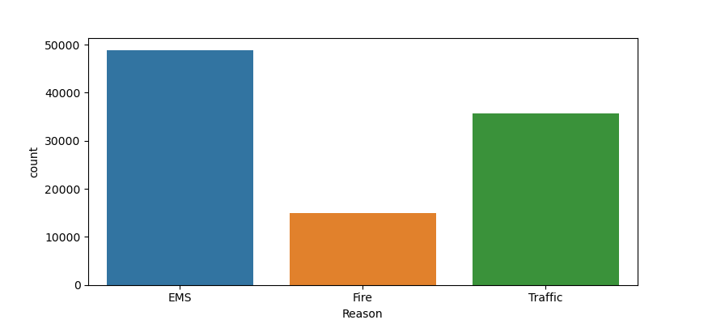


Now let us focus on time information. What is the data type of the objects in the timeStamp column?

````python
df['timeStamp'].info()
````

which returns the following series:

````
<class 'pandas.core.series.Series'>
RangeIndex: 99492 entries, 0 to 99491
Series name: timeStamp
Non-Null Count  Dtype 
--------------  ----- 
99492 non-null  object
dtypes: object(1)
memory usage: 777.4+ KB
None
````

It is showing object string data type that the column we are working with has a string data type.


Now let us convert the data type of the `timeStamp` column into DataTime objects. We can do this by reassigning the `timeStamp` column and using the `to_dateTime` function to convert the strings of the `timeStamp` column into datetime objects.  


````python
df['timeStamp'] = pd.to_datetime(df['timeStamp'])
````

Now we want to create three seperate columns: `Hour`, `Month`, and `Day of Week` from the `timeStamp` column. We can do this by grabbing the attribute of each datetime objet inside of the `timeStamp` column. We can do this by using lambda expressions:

````python
df['Hour'] = df['timeStamp'].apply(lambda x: x.hour) # creates an 'Hour' column

df['Month'] = df['timeStamp'].apply(lambda x : x.month) # creates a 'Month' column

df['Day of Week'] = df['timeStamp'].apply(lambda x: x.dayofweek) # returns all the rows as day of the week
````
Notice that the rows of the `Day of Week`  column is in terms of numbers instead of Monday, Tuesday, Wednesday, Thursday, and Friday. We can make a dictionary that creates the integers found in the `Day of Week ` column as keys that map to the day of the week.

````python
dmap = {
        0:'Mon',
        1:'Tue',
        2:'Wed',
        3:'Thu',
        4:'Fri',
        5:'Sat',
        6:'Sun'
        }

df['Day of Week'] = df['Day of Week'].map(dmap)

````


Now that the `Day of Week` column contains rows that map to each day in the week, let's use seaborn to create a countplot with the hue based off of the Reason column. We can do this by typing the following code:
````python
sns.countplot(x = 'Day of Week' , hue = 'Reason'  data  = df)
plt.legend(bbox_to_anchor=(1.0, 0.75)) # put legend outside of plot
````

which returns the following plot: 


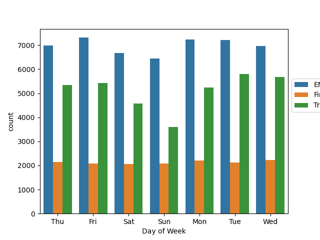

We can create a similar plot for the `Month` column which can be done in the following way:
````python
sns.countplot(x = 'Month' , hue = 'Reason' , data = df)
plt.legend(bbox_to_anchor=(1.0, 0.75)) # put legend outside of plot
````

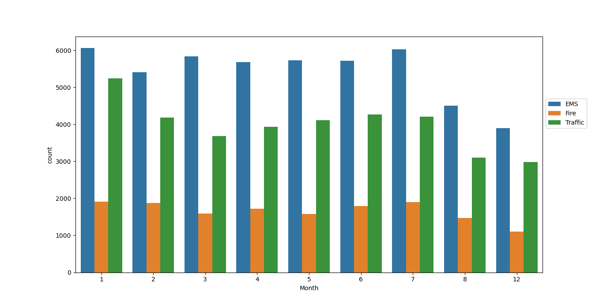

Notice that there is something wrong with our countplot of the `Month` column above; that is, we have months 9-11 that have not been accounted for. A solution for this is to create a simple line plot that will fill in the missing information. A way to do this is to use the `groupBy` method to group the columns of our dataframe using the `Month` column. Then we can plot our data using seaborn:

````python
byMonth =  df.groupby('Month').count()
sns.lineplot(data = byMonth)
````

which will return the following line plot:

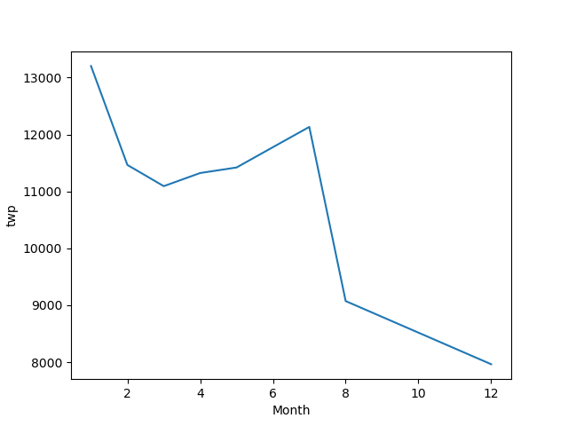


We can also create a line of best fit for the number of calls per month:
````python
sns.lmplot(data = byMonth.reset_index(), x = 'Month', y = 'twp')
````

which returns the following plot:

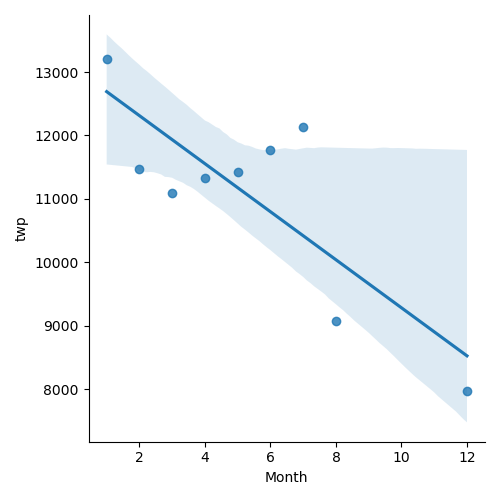


Create a new column `Date` that contains the date from the `timeStamp` column. You'll need to use along with the `.date()` method.
````python
df['Date'] = df['timeStamp'].apply(lambda x: x.date())
````
We can groupby this new column along with the `count()` aggregate function to create a plot of counts of 911 calls.

````python
byDate = df.groupby('Date')['twp'].count()
sns.lineplot(data = byDate)
````
which returns the following lineplot:


We can employ the same methods to create three seperate plots representing each Reason for the 911 call.

1. Traffic Calls

````python
byDateTraffic = df[df['Reason'] == 'Traffic'].groupby('Date')['twp'].count() 
sns.lineplot(data = byDateTraffic)
plt.title('Traffic')
plt.show()
````

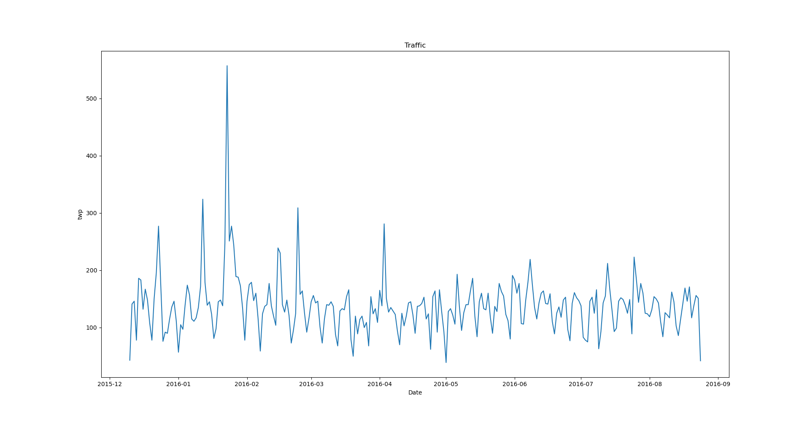


2. Fire
````python

byDateFire = df[df['Reason'] == 'Fire'].groupby('Date')['twp'].count() 
sns.lineplot(data = byDateFire)
plt.title('Fire')
plt.show()
````
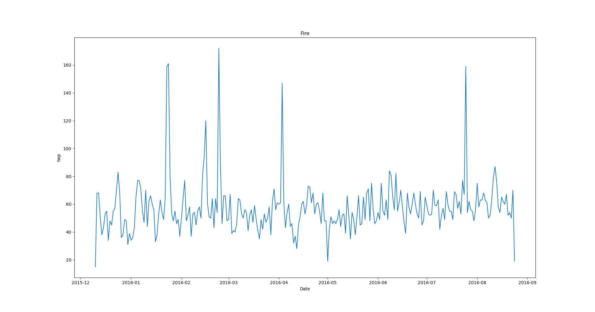


3. EMS

````python
byDateEMS = df[df['Reason'] == 'EMS'].groupby('Date')['twp'].count() 
sns.lineplot(data = byDateEMS)
plt.title('EMS')
plt.show()
````
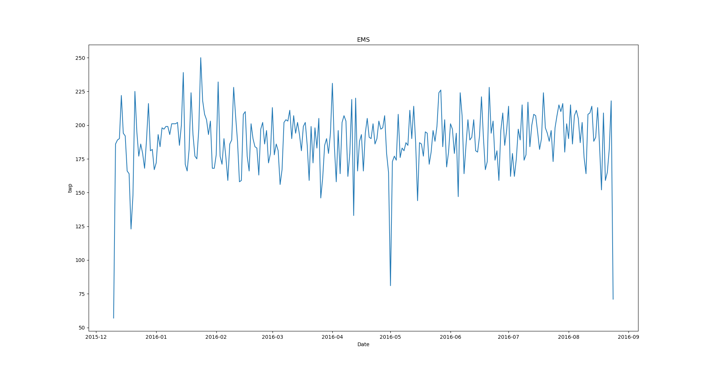

## Creating Heatmaps 

Before creating the heatmaps using seaborn, we'll need to change our dataframe so that the columns become the hours and the Index become the `Day of the Week`. There are many ways to do this, but the recommended way is to use a combination of the `groupby` method with an `unstack ` method.

This method takes on the same process as we've done in the creation of plots before this one. We can assign the following method onto a variable named `groupByDay`
````python
groupByDay = df.groupby(by = ['Day of Week', 'Hour']).count()['Reason'].unstack() # the unstack method turns our groupby object into matrix form
````
which will return the following dataframe if we pass in the code above into a print function:
````
Hour          0    1    2    3    4    5    6   ...    17   18   19   20   21   22   23
Day of Week                                     ...                                    
Fri          275  235  191  175  201  194  372  ...   980  820  696  667  559  514  474
Mon          282  221  201  194  204  267  397  ...   997  885  746  613  497  472  325
Sat          375  301  263  260  224  231  257  ...   757  778  696  628  572  506  467
Sun          383  306  286  268  242  240  300  ...   714  670  655  537  461  415  330
Thu          278  202  233  159  182  203  362  ...  1013  810  698  617  553  424  354
Tue          269  240  186  170  209  239  415  ...  1019  905  731  647  571  462  274
Wed          250  216  189  209  156  255  410  ...  1037  894  686  668  575  490  335
````

We can now make a heatmap by typing the following code:

````python
sns.heatmap(groupByDay)
````

which returns the following matrix plot:

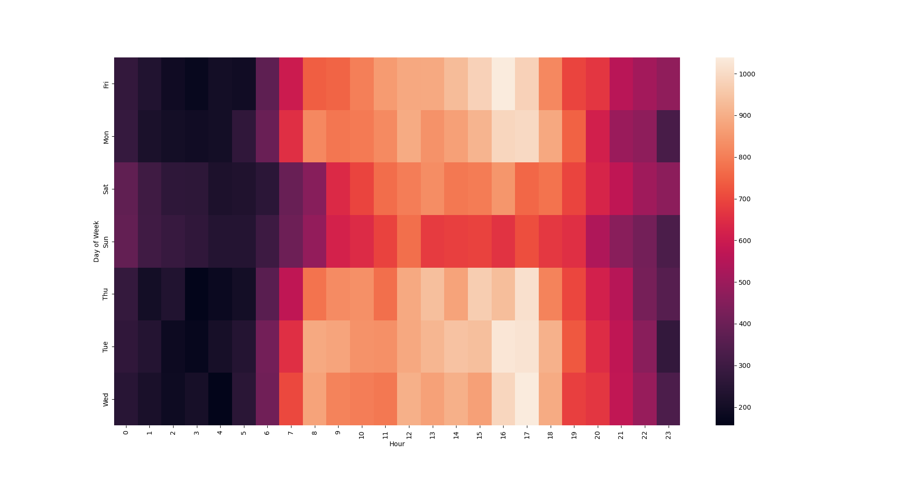

We can also make a cluster map representing our new dataframe:

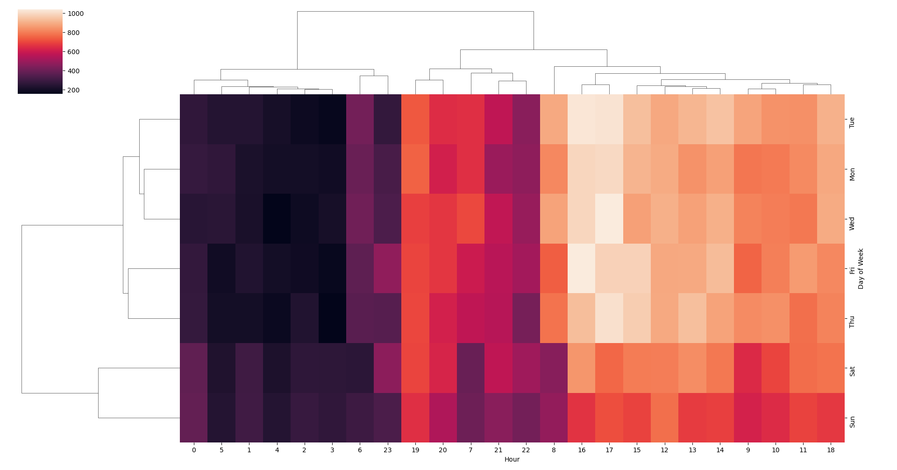

Using the same methods, we can restructure our dataframe in the same way but this time using `Month` as our columns instead of `Hour`:

````python
groupByMonth = df.groupby(by = ['Day of Week', 'Month']).count()['Reason'].unstack()
sns.heatmap(groupByMonth)
sns.clustermap(groupByMonth)
````

which creates the following two plots:


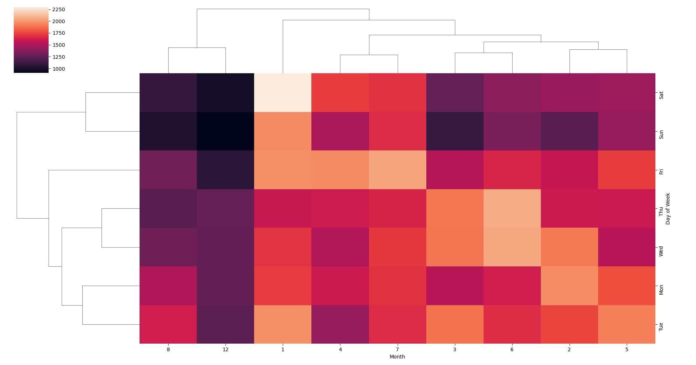

