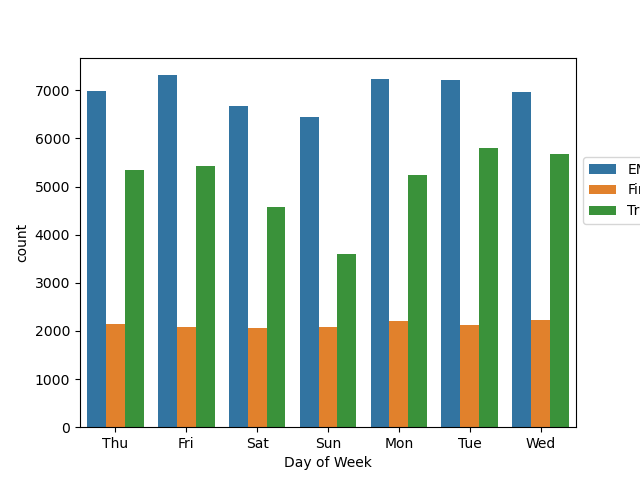

# 911 Calls Capstone Project

For this capstone project we will be analyzing some 911 call data from Kaggle. The data contains the following fields:


  -  lat : String variable, Latitude
  -  lng: String variable, Longitude
  -  desc: String variable, Description of the Emergency Call
  -  zip: String variable, Zipcode
  -  title: String variable, Title
  -  timeStamp: String variable, YYYY-MM-DD HH:MM:SS
  -  twp: String variable, Township
  -  addr: String variable, Address
  -  e: String variable, Dummy variable (always 1)

We will start by importing the necessary modules: 

````python
import numpy as np
import pandas as pd
import matplotlin.pyplot as plt
import seaborn as sns
````

Let's start by reading in the csv file and assign it to the variable `df` where:
````python
df = pd.read_csv('911.csv')
````

We can check the info of this dataframe by typing the following code:

````python
df.info()
````
which should return the following information about our data:

````
 #   Column     Non-Null Count  Dtype  
---  ------     --------------  -----  
 0   lat        99492 non-null  float64
 1   lng        99492 non-null  float64
 2   desc       99492 non-null  object 
 3   zip        86637 non-null  float64
 4   title      99492 non-null  object 
 5   timeStamp  99492 non-null  object 
 6   twp        99449 non-null  object 
 7   addr       98973 non-null  object 
 8   e          99492 non-null  int64  
dtypes: float64(3), int64(1), object(5)
memory usage: 6.8+ MB
````

Checking the head by typing:

````python
df.head()
````
gives us information of the first few rows of our data:

````
         lat        lng  ...                        addr  e
0  40.297876 -75.581294  ...      REINDEER CT & DEAD END  1
1  40.258061 -75.264680  ...  BRIAR PATH & WHITEMARSH LN  1
2  40.121182 -75.351975  ...                    HAWS AVE  1
3  40.116153 -75.343513  ...          AIRY ST & SWEDE ST  1
4  40.251492 -75.603350  ...    CHERRYWOOD CT & DEAD END  1

[5 rows x 9 columns]
````

## Basic Questions

Some basic questions we can ask about our 911 calls data is:


1. What are the top 5 zipcodes for 911 calls?


We can answer this question by typing the following code:

````python
df['zip'].value_counts().head(5)
````

which returns the following series
````
19401.0    6979
19464.0    6643
19403.0    4854
19446.0    4748
19406.0    3174
Name: zip, dtype: int64
````

2. What are the top 5 townships (twp) for 911 calls?

````python
df['twp'].value_counts().head(5)
````

````
LOWER MERION    8443
ABINGTON        5977
NORRISTOWN      5890
UPPER MERION    5227
CHELTENHAM      4575
Name: twp, dtype: int64
````

3. How many unique title codes are there?

````python
df['title'].nunique()
````

which returns `110` unique title codes.


## Creating new features

 In the titles column there are "Reasons/Departments" specified before the title code. These are EMS, Fire, and Traffic. Use .apply() with a custom lambda expression to create a new column called "Reason" that contains this string value.*

We can use a lambda expression to to split the strings found in the `title` column of our data to find each value in our new column `Reason`.

````python
df['Reason'] =  df['title'].apply(lambda x: x.split(':')[0])
````
The code above returns the following series:

````
0            EMS
1            EMS
2           Fire
3            EMS
4            EMS
          ...   
99487    Traffic
99488    Traffic
99489        EMS
99490        EMS
99491    Traffic
Name: Reason, Length: 99492, dtype: object
````

What is the most common Reason for a 911 call based off of this new column?

````python

df['Reason'].value_counts().head(3)
````

which will return the top three common reasons to call 911:
````
EMS        48877
Traffic    35695
Fire       14920
Name: Reason, dtype: int64
````


Now let us focus on time information. What is the data type of the objects in the timeStamp column?

````python
df['timeStamp'].info()
````

which returns the following series:

````
<class 'pandas.core.series.Series'>
RangeIndex: 99492 entries, 0 to 99491
Series name: timeStamp
Non-Null Count  Dtype 
--------------  ----- 
99492 non-null  object
dtypes: object(1)
memory usage: 777.4+ KB
None
````


It is showing object string data type that the column we are working with has a string data type.


Now let us convert the data type of the `timeStamp` column into DataTime objects. We can do this by reassigning the `timeStamp` column and using the `to_dateTime` function to convert the strings of the `timeStamp` column into datetime objects.  


````python
df['timeStamp'] = pd.to_datetime(df['timeStamp'])
````

Now we want to create three seperate columns: `Hour`, `Month`, and `Day of Week` from the `timeStamp` column. We can do this by grabbing the attribute of each datetime objet inside of the `timeStamp` column. We can do this by using lambda expressions:

````python
df['Hour'] = df['timeStamp'].apply(lambda x: x.hour) # creates an 'Hour' column

df['Month'] = df['timeStamp'].apply(lambda x : x.month) # creates a 'Month' column

df['Day of Week'] = df['timeStamp'].apply(lambda x: x.dayofweek)
````
Now let's use seaborn to create a countplot of the `Day of Week` column with the hue based off of the Reason column. We can do this by typing the following code:
````python
sns.countplot(x = 'Day of Week' , hue = 'Reason'  data  = df)
plt.legend(bbox_to_anchor=(1.0, 0.75)) # put legend outside of plot
````

which returns the following plot: 




We can create a similar plot for the `Month` column which can be done in the following way:
````python
sns.countplot(x = 'Month' , hue = 'Reason' , data = df)
plt.legend(bbox_to_anchor=(1.0, 0.75)) # put legend outside of plot
````


Notice that there is something wrong with our countplot of the `Month` column above; that is, we have months 9-11 that have not been accounted for. A solution for this is to create a simple line plot that will fill in the missing information. 
